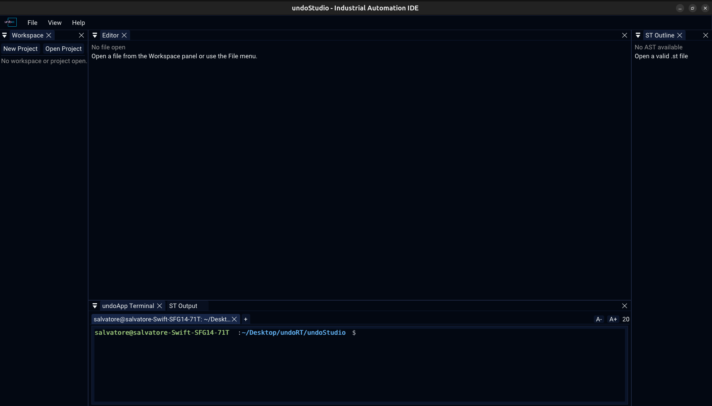

# undoStudio

The IDE of the undoRT ecosystem: an open development environment for
industrial automation, built as a framework plus independent **undoApps** instead of
one monolithic program.

Each release is in [CHANGELOG.md](CHANGELOG.md); the feature documentation is in
[docs/](docs/).

## What it does

| | |
|---|---|
| **Editor** | One panel for every kind of file: Structured Text, JSON, C++ and plain text, each in its own tab. → [docs/editor.md](docs/editor.md) |
| **Structured Text** | IEC 61131-3 POU editing, split Variables/Body, methods, semantic colouring, outline, compilation through st2cpp. → [docs/structured-text.md](docs/structured-text.md) |
| **Autocomplete** | Identifier, member and statement completion, signature help, and declaration jumps. → [docs/autocomplete.md](docs/autocomplete.md) |
| **Workspace** | The file tree, drag to move, rename, delete, and new POUs and folders. → [docs/workspace.md](docs/workspace.md) |
| **JSON** | Configuration as editable text, everything else as a browsable tree. → [docs/json.md](docs/json.md) |
| **Projects** | Open and create a project, and its `.undoProject/` descriptor. → [docs/projects.md](docs/projects.md) |
| **Recent** | Recent projects (`Ctrl+R`) and recent files (`Ctrl+P`), both remembered between runs. → [docs/recent.md](docs/recent.md) |
| **Output** | Build and validation messages with severity filters and search, and the generated ST. → [docs/output.md](docs/output.md) |
| **Terminal** | An embedded shell in a tab of its own. → [docs/terminal.md](docs/terminal.md) |
| **UndoApps** | The plugin model, and how to write one. → [docs/undoapps.md](docs/undoapps.md) |

## Requirements

| | |
|---|---|
| OS | Linux (developed and tested on Ubuntu 24.04) |
| Compiler | C++17, GCC 13 or Clang 15 and later |
| CMake | 3.15 or later |
| GPU | OpenGL 3.x, through GLFW |

Debian and Ubuntu:

~~~bash
sudo apt install build-essential cmake git

# OpenGL and GLU
sudo apt install libgl1-mesa-dev libglu1-mesa-dev freeglut3-dev

# X11, which is what GLFW builds against here
sudo apt install libx11-dev libxrandr-dev libxinerama-dev libxcursor-dev libxi-dev libxext-dev

# glm, header-only, and a hard requirement: CMake stops if it is missing
sudo apt install libglm-dev
~~~

Everything else is a submodule — GLFW, Dear ImGui, implot, ImGuiColorTextEdit,
st2cpp, stb, tinyfiledialogs, nlohmann_json — and is built from source.

## Build

~~~bash
git clone --recursive https://github.com/undoRT/undoStudio.git
cd undoStudio

cmake -B build -DCMAKE_BUILD_TYPE=Release
cmake --build build -j"$(nproc)"
~~~

`git submodule update --init --recursive` if the clone was not recursive.

| Option | Default | Effect |
|---|---|---|
| `BUILD_EDITOR_APP` | `ON` | Build the Editor undoApp, the ST/JSON/text/C++ environment |
| `BUILD_TERMINAL_APP` | `ON` | Build the Terminal undoApp |
| `BUILD_DEMO_APP` | `OFF` | Build the Demo undoApp |
| `USE_SYSTEM_GLFW` | `OFF` | Use the system GLFW instead of the bundled one |
| `ENABLE_IMGUI_DOCKING` | `ON` | Build Dear ImGui with docking support |
| `USE_TINYFILEDIALOGS` | `OFF` | Use tinyfiledialogs for native file dialogs |

## Run

Start it from the repository root, because fonts, icons and themes are opened by
relative path:

~~~bash
./build/undoStudio
~~~

The binary, the core library and the undoApps are written next to `resources/`,
which is how the IDE finds them at run time: `undoStudio`,
`libundoStudioCore.so` and `plugins/*.so`. `cmake --install` puts them in
`share/undoStudio`, and that directory has to be the working directory too.

## The Structured Text transpiler

**Compile** shells out to st2cpp, which is a submodule but is built separately:

~~~bash
cmake -S third_party/st2cpp -B build/st2cpp -DCMAKE_BUILD_TYPE=Release
cmake --build build/st2cpp -j"$(nproc)"
~~~

That leaves the binary at `build/st2cpp/st2cpp`. A st2cpp on `PATH` is preferred,
and the path actually used is printed in the ST Output panel. A missing
transpiler is reported plainly and nothing else stops working.

## Tests

All three suites are headless: no GPU, no display.

~~~bash
./src/core/tests/run_tests.sh                      # 12 tests
./undoApps/undoApp.Editor/tests/run_tests.sh       # 26 tests
./undoApps/undoApp.Terminal/tests/run_tests.sh     # 2 tests

# a subset, by name
./undoApps/undoApp.Editor/tests/run_tests.sh completion
~~~

The Editor and Terminal suites need the project built, because they link against
`libundoStudioCore.so`, `libimgui.a` and `libimplot.a`.

## Architecture

undoStudio owns the application lifecycle, the window, the ImGui framework and the
project on disk. It implements no domain functionality: an undoApp that has to be
linked into the executable is an undoApp that cannot be shipped separately.

~~~bash
undoStudio (core: lifecycle, window, ImGui, projects)
  |
  +-- plugins/*.so
        |-- undoApp.Editor      ST, JSON, C++ and text editing
        |-- undoApp.Terminal    embedded shell
        `-- undoApp.Demo        the smallest possible undoApp
~~~

See [docs/undoapps.md](docs/undoapps.md) for the model and for the undoRT modules
the IDE is meant to sit in front of.

## Repository layout

~~~bash
undoStudio/
|-- CMakeLists.txt            top-level build, install and CPack
|-- docs/                     feature documentation and its images
|-- include/undoStudio/       public headers of the core
|   |-- core/                 application, plugins, projects
|   |-- services/             window service interface
|   `-- ui/                   ImGui framework
|-- src/                      the same, implemented
|-- resources/                fonts, icons, themes, shipped layout
|-- undoApps/                 one directory per undoApp, each with its own tests
|-- third_party/              submodules
`-- build/                    build tree
~~~

## Documentation

- [docs/editor.md](docs/editor.md) — the panels, and which backend a file gets
- [docs/keyboard.md](docs/keyboard.md) — every shortcut
- [docs/state.md](docs/state.md) — what is remembered between runs
- [docs/testing.md](docs/testing.md) — how the headless suites work