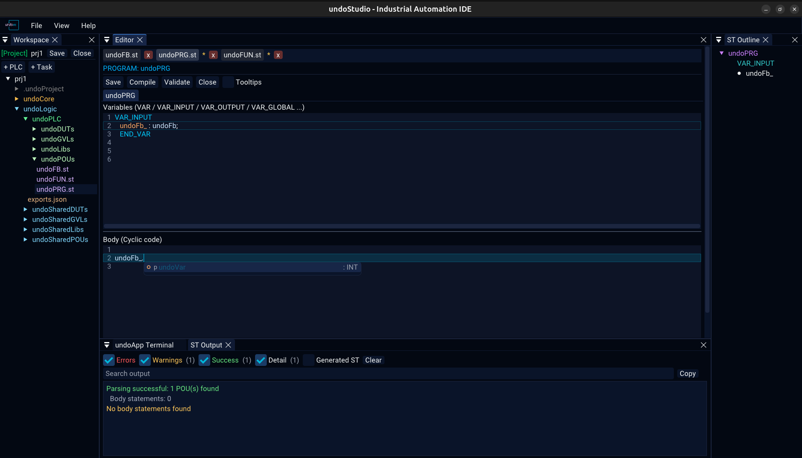
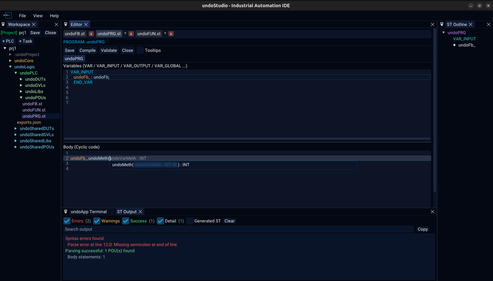

# Autocomplete and signature help

Three separate lists, plus signature help and declaration jumps. All of them are
driven by the parsed file, so what they offer is what the file actually declares.

## The three lists

| List | Offered when | Offers |
|---|---|---|
| Member | after a `.` | The fields and methods of the thing before the dot |
| Statement | on a keyword fragment | The ST statements and declarations that begin with what is typed |
| Signature help | inside the parentheses of a call | That function's parameters, one per line, with the one being filled in marked |

Without a `.` the identifier being typed is the prefix, so a half-typed variable or
method name is completable too. Neither list opens inside a comment or a string
literal, where a name cannot be completed anyway.

Only one list is ever on screen. A statement list answers about the same word a
member list would and only one of them can apply, so the more specific one wins.

The statement list knows which pane it is in: the declarations pane offers the
declarations, the body pane the statements.

## Parameters of a call

Inside a call, the parameters are the one thing a list can offer that the text
cannot: what the callee is called, written out as names.

- **`Tab`** opens the parameter picker for the call being written.
- At the caret, the name and type of the parameter being filled in are shown in
  grey as a hint — the same hint an empty argument slot gets.

`Esc` closes either list. The text still reads `inst.`, so a list that reopened on
the next frame would make `Esc` look like it had done nothing.

## Navigating a list

| Key | |
|---|---|
| `↑` `↓` | move one row |
| `PageUp` `PageDown` | move a page |
| `Tab` | next |
| `Enter` | accept |
| `Esc` | dismiss |

The list is drawn as its own window next to the cursor, kept inside the editor's
bounds, and it moves aside if the signature help is already there.

## Ctrl+Click goes to the declaration

Hold `Ctrl` and click an identifier to jump to where it is declared, across files.
The status line says so while the mouse is over it, and a click on something that
is not declared is reported in the ST Output panel.

## Tooltips

Off by default. The switch is on the ST toolbar.