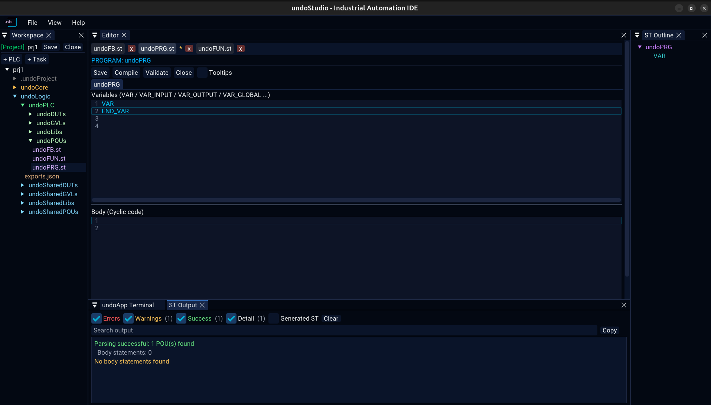
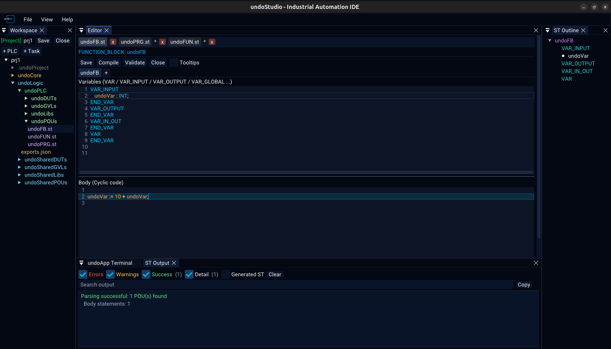

# The Editor panel

undoStudio has **one** editor panel. A Structured Text file, a JSON file, a C++
file and a plain text file all open in it, each in its own tab, above the same tab
bar.

## The tab bar

| | |
|---|---|
| A click keeps the tab | There is one preview slot, and browsing the tree through it replaces what was there. A file somebody asked to see is still there when they ask for another one. |
| A second click is not needed | ImGui only reports a double click when both clicks land within a few pixels of each other — a rule nobody can see. |
| An asterisk means unsaved changes | It is the file's own text that is asked, not a flag set when the tab was left. Browsing past a file with edits pins it rather than throwing the typing away. |
| `Ctrl+S` saves | The button is there too, in the ST toolbar. |
| Closing a tab unloads the file | Closing the project clears them all. |
| Renaming follows the file | A rename or a move in the tree rewrites the tab, the path a save goes to, and the key its text is held under — all four, or `Ctrl+S` writes a copy where the original used to be. A deleted file takes its tab with it. |

A file that is not on screen is not kept in memory as text on disk: its unsaved
contents are stashed, and the stash is handed back when the tab is selected again.

## Which backend a file gets

| Extension | Backend | Notes |
|---|---|---|
| `.st` | Structured Text | [structured-text.md](structured-text.md) |
| `.json` | JSON, or Text if it is project configuration | [json.md](json.md) |
| `.c` `.cpp` `.cc` `.cxx` `.h` `.hpp` `.hh` `.hxx` | C++ | Syntax colouring from ImGuiColorTextEdit's own definition |
| anything else | Text | No colouring |

Which backend a `.json` gets is the **file's role, not its extension**, answered
from the project that is open. That is why a `.json` outside any project is a tree
and the same extension inside one is text: the configuration is the file the user
is told to edit by hand, and a tree has nothing to type into.

## Switching a `.json` between text and tree

Right-click any `.json` in the Workspace tree:

- **Open as Text** — the editable view
- **Open as Tree** — the browsable view

Both **replace** the tab rather than adding a second one. One file is one row in
the bar, and the row is whichever view it is in.

## Panels beside it

| Panel | What is in it |
|---|---|
| **Workspace** | The file tree, and the project toolbar — [workspace.md](workspace.md) |
| **ST Output** | Build and validation messages — [output.md](output.md) |
| **ST Outline** | The POU, its sections, methods, structs and enums, from the parsed file — [structured-text.md](structured-text.md) |
| **undoApp Terminal** | An embedded shell — [terminal.md](terminal.md) |

All four are listed under **View** and can be shown or hidden, and **View > Reset
Layout** puts them back where the shipped layout has them.