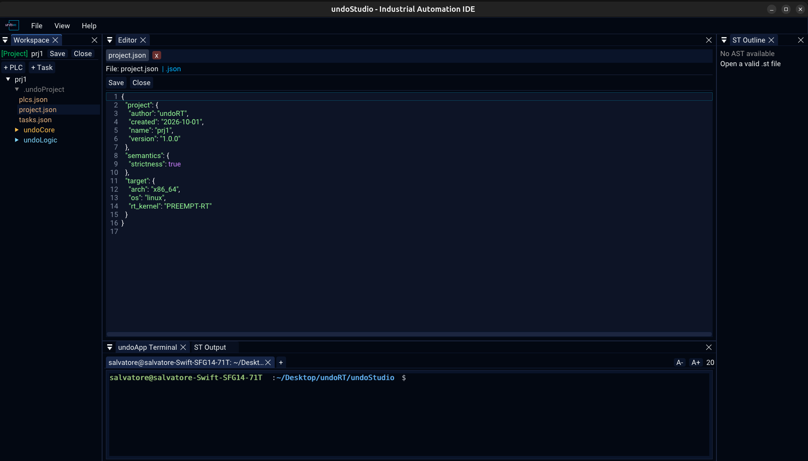
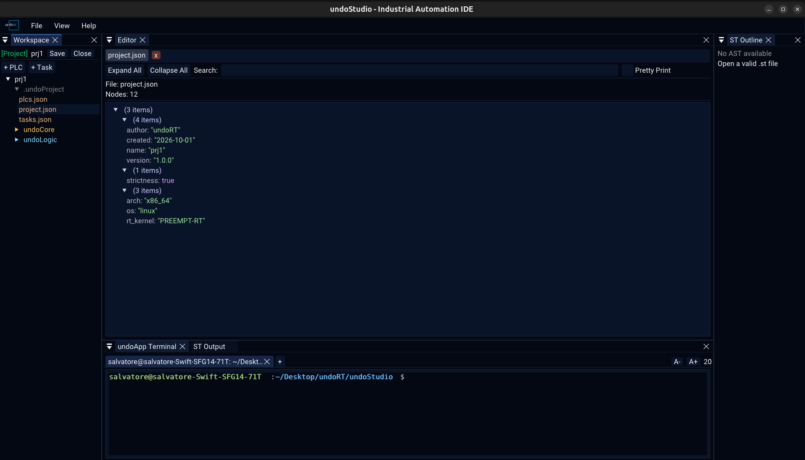

# JSON

A `.json` file gets one of two backends: **text**, which you can edit, or the
**tree viewer**, which you can only look at. Which one it gets is the file's role,
not its extension.

## Why two backends

A project's own configuration is JSON and would go to the viewer by extension, and
the viewer draws a tree and has nothing to type into. Those are the files the user
is told to edit by hand — `exports.json` holds the PROGRAM order, a task file its
cycle time — so they open as text.

Every other `.json` gets the tree.

Outside a project there are no configuration files, so a `.json` there is a tree.

## Switching

Right-click any `.json` in the Workspace tree:

- **Open as Text**
- **Open as Tree**

Both **replace** the tab rather than adding a second one. One file is one row in the
tab bar, and the row is whichever view it is in.

## The tree viewer

Read-only, and it says so rather than pretending otherwise.

| | |
|---|---|
| **Expand All** / **Collapse All** | open or close every node |
| **Search** | keep only the nodes whose key or value matches |
| **Pretty Print** | the file re-serialised with two-space indentation, instead of the tree |
| **Hover a value** | its full text as a tooltip, so a long value can be read |
| **Header** | the file name and the number of nodes |

There is no **Open File** button in the viewer. Files are opened from the
Workspace tree, and `EditorApp::openFile` is what puts one in a tab.

## The configuration files

All JSON, no TOML, and nothing reads or migrates the old format:

| File | What it holds |
|---|---|
| `.undoProject/project.json` | the project's name, version, author and creation date; the target architecture, OS and kernel; and the semantics settings |
| `.undoProject/plcs.json` | the PLCs in the project |
| `.undoProject/tasks.json` | the task list |
| `undoCore/tasks/<name>.json` | one task: its PLC, cycle, priority and CPU |
| `undoLogic/<plc>/exports.json` | the PROGRAM order of one PLC |

`strictness` under `semantics` is a boolean rather than the `"on"` / `"off"`
string it was before, and a project written before that key existed reads as strict,
which is what a new project is written with.