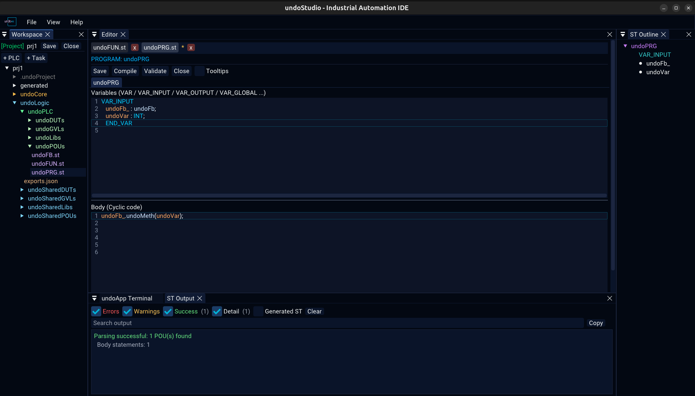

# ST Output

Everything the compile and the validation say, in one panel, filterable.

## Compiling

**Compile** on the ST toolbar hands the project to **st2cpp**, which is a separate
command-line binary built from `third_party/st2cpp`:

~~~bash
cmake -S third_party/st2cpp -B build/st2cpp -DCMAKE_BUILD_TYPE=Release
cmake --build build/st2cpp -j"$(nproc)"
~~~

The Editor looks for st2cpp on `PATH` first and then at `build/st2cpp/st2cpp`, and
**prints the path it used** at the top of this panel. A missing transpiler is
reported plainly and nothing else stops working — it is not an exit status that
fails the IDE.

**Validate** parses and analyses without generating.

## The panel

| | |
|---|---|
| Errors, Warnings, Success, Detail | show or hide each severity, with a count beside it |
| Generated ST | the generated file in full, off by default |
| Search output | filter the lines |
| Copy | the lines currently shown, not the whole log |
| Clear | empty the panel |

The search belongs to the panel and to the workspace it was typed in. A query left
over from one project does not filter the next project's log to nothing.

## The generated file is not the file you edit

A `.st` file is not edited as one blob. It is regenerated from the panes being
edited, and a **source map** maps each generated line back to the editor that owns
it. A diagnostic is therefore reported against the generated file, and its line
numbers mean nothing without that map.

## A POU is saved and compiled whole

**Save** and **Compile** serialize every method tab of the POU, not only the one on
screen. See [structured-text.md](structured-text.md).