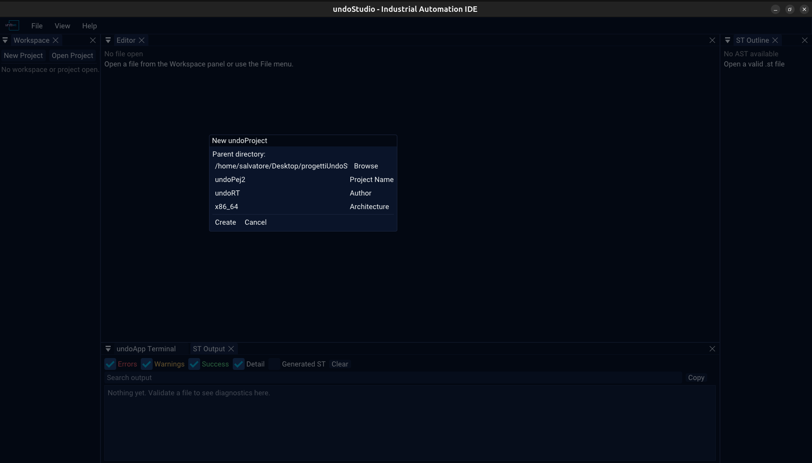

# Projects

A project is a directory with a `.undoProject/` descriptor in it. Opening one
changes what the Workspace tree shows and what a `.json` opens as.

## Creating one

**New Project** in the Workspace toolbar asks for a name, a parent directory and an
author, then writes the descriptor. **Open Project** picks a directory that already
has one; the dialog is a folder chooser, and it falls back to `zenity` when
tinyfiledialogs is not compiled in.

With a project open the header names it in green, with **Save** and **Close** beside
it. **Save** writes the descriptor back; **Close** drops back to the plain workspace
and clears the tab bar.

## The two toolbars

The Workspace panel has a toolbar above the tree and a second one below it.

| | Without a project | With a project |
|---|---|---|
| **Above** | **New Project**, **Open Project**, **Select Workspace**, **Refresh** | the project name, **Save**, **Close**, **Select Workspace**, **Refresh** |
| **Below** | **+ POU**, **+ Folder**, **+ File** | **+ PLC**, **+ Task** |

**Select Workspace** is the folder-without-a-project case: the tree is flat and the
folder is where files are opened from.

## What a project is on disk

~~~bash
myProject/
|-- .undoProject/
|   |-- project.json          name, version, author, target, semantics
|   |-- plcs.json             the PLCs
|   `-- tasks.json            the task list
|-- undoCore/
|   |-- tasks/                one JSON file per task
|   `-- ...                   the core sources
|-- undoLogic/
|   `-- <plc>/
|       `-- exports.json      the PROGRAM order of that PLC
`-- ...
~~~

All of it is JSON, and nothing reads or migrates the old TOML format, so a project
written against it has to be rewritten once. See [json.md](json.md) for the two
backends a `.json` can get.

## Without a project

A folder can be opened as a workspace with no project in it. The tree is flat rather
than role-aware, the folder context menu offers the generic **New POU** / **New File**
/ **New Folder**, and every `.json` in it is a tree rather than configuration.

## The tree knows the roles

With a project open, the tree is built from the roles in `plcs.json` and the shape of
the directory rather than from names alone: `undoLogic/<plc>/exports.json` is the PLC's
exports file because the PLC is in the list, not because of what it is called. A
project with no `plcs.json` has no PLC, and its exports file is an ordinary `.json`.

## Recent projects

A project that has been open is remembered between runs: [recent.md](recent.md).