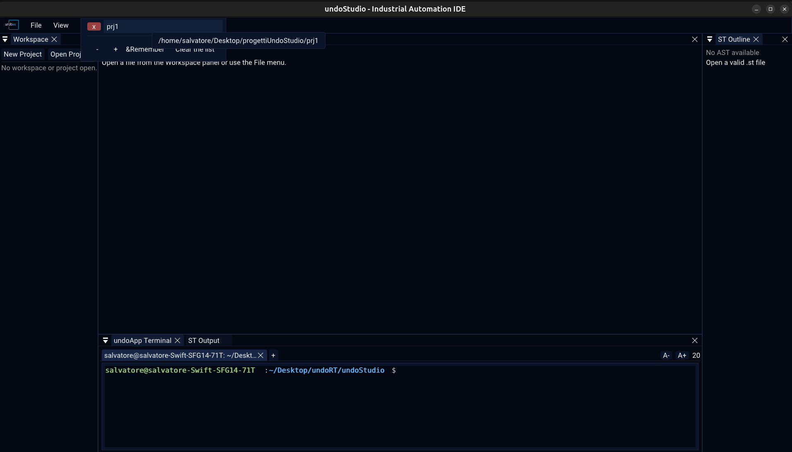

# Recent projects and recent files

Two lists, both remembered between runs, both one click away and neither of them
opening anything on its own.

## Opening one

| | |
|---|---|
| **Recent projects** | **File > Open Recent Projects**, or `Ctrl+R` |
| **Recent files** | **File > Open Recent Files**, or `Ctrl+P` |

`Ctrl+P` is what reaches for a file in VS Code. `Ctrl+R` is the recent projects, so
the file list could not have had it, and the two are worth telling apart on the
keyboard as well as in the menu.

Both keys are left alone while a code editor or the terminal has the keyboard, where
the same two keys mean something else entirely.

**Nothing is reopened on its own.** A project is not opened at startup because it
happens to be on disk, and a file is not reopened because it was open last time: the
list is one key away, and starting the IDE with somebody's work already loaded is a
surprise.

## Inside a popup

| | |
|---|---|
| **↑ ↓ Enter** | walk the list and open the one chosen, without a mouse — ImGui keyboard navigation is on |
| **`x`** | forget that one entry |
| **Hover** | the full path |
| **Remember** | how many to keep |
| **Clear the list** | empty it |
| **`Esc`**, or a click elsewhere | close |

A row is its full path as far as its identity goes, not its name: two projects can
be called `main` in two different folders, and a row identified by its name is one
widget drawn twice, so the second can never be picked.

An entry whose file or folder is gone is kept and shown as **`(missing)`**, rather
than dropped. An entry vanishing is never a mistake, and a name that does nothing
when clicked is worse than one that says why.

## The files list

- A file is remembered however it was reached — clicked in the tree, opened from the
  menu, dropped onto the window — and **opening it puts it back where it was**, at
  the cursor and the pane it was left in.
- The list is ordered by when a file was **last looked at**, not by when it was first
  opened, so switching back to a file moves it to the top.
- A file remembered here **follows a rename or a move**: rename it in the tree and
  the entry is rewritten in place.

## One limit, two lists

Both lists read and write the same `max` key in the same `[recent]` section of
`undoStudio.ini`. There is nothing useful to configure separately about how much of
two lists of the same kind to remember, and the limit is editable **in the popup it
governs** — a limit reached by opening more than ten projects is a limit nobody
could reach deliberately.

Changing it through either list trims the other on the next load.