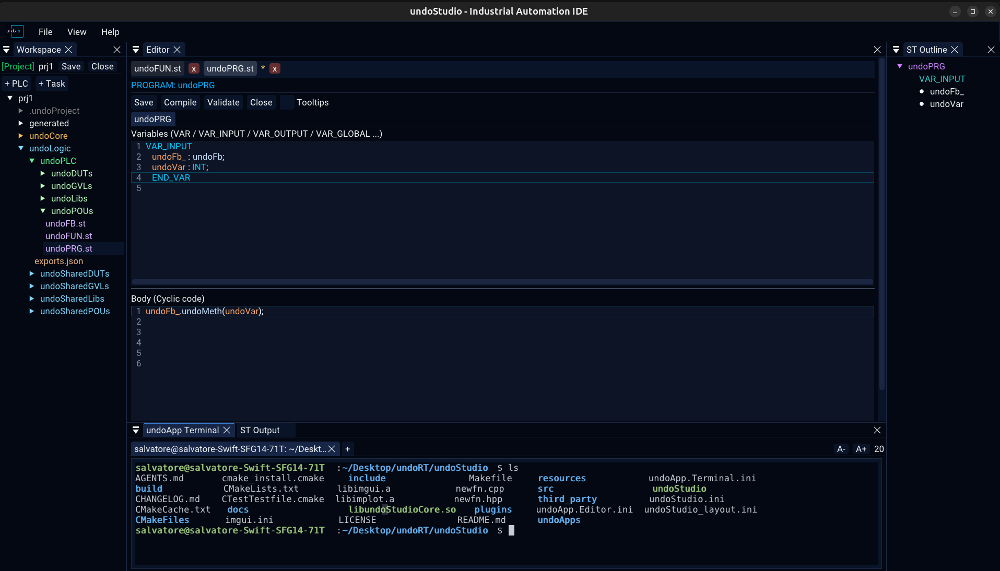

# Terminal

An embedded shell, in a tab of its own, in the `undoApp Terminal` panel.

| | |
|---|---|
| **`+`** | a new shell |
| **`x`** on a tab | close that shell |
| **`A-`** / **`A+`** | smaller / larger text, with the size in pixels beside them |
| **`Ctrl`** + wheel | the same as the buttons |

The buttons are there because a terminal sized by a shortcut nobody can find is a
terminal people stop reading.

The size it is opened at is remembered per workspace in `undoApp.Terminal.ini`.

## What it is

A `libvterm` terminal drawn with ImGui, each tab running a real shell on a pty. The
tab bar is the point of it rather than one shell: a build that is running in one tab
does not stop you using another.

Two things about it that are easy to get wrong and are handled here:

- **libvterm stores the pointer, not a copy, of its callback table.** It has to be a
  static, or it is dangling by the time the first byte arrives.
- **`vterm_obtain_state` does not install the character encodings.**
  `vterm_state_reset(state, 1)` does, and without it the first byte that is not a
  control sequence dereferences a null encoding.

## Known limitation

A terminal tab **cannot be dragged to reorder**, unlike the file tabs beside it.
ImGui would move the tab and the panel would keep drawing the shell it thinks is
there, so it is not offered rather than offered and wrong.