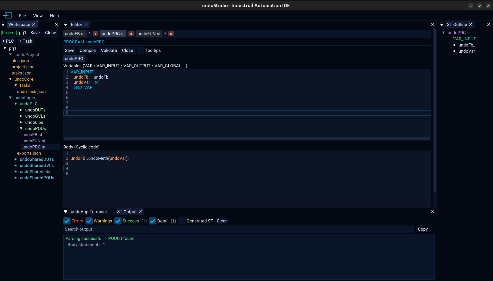
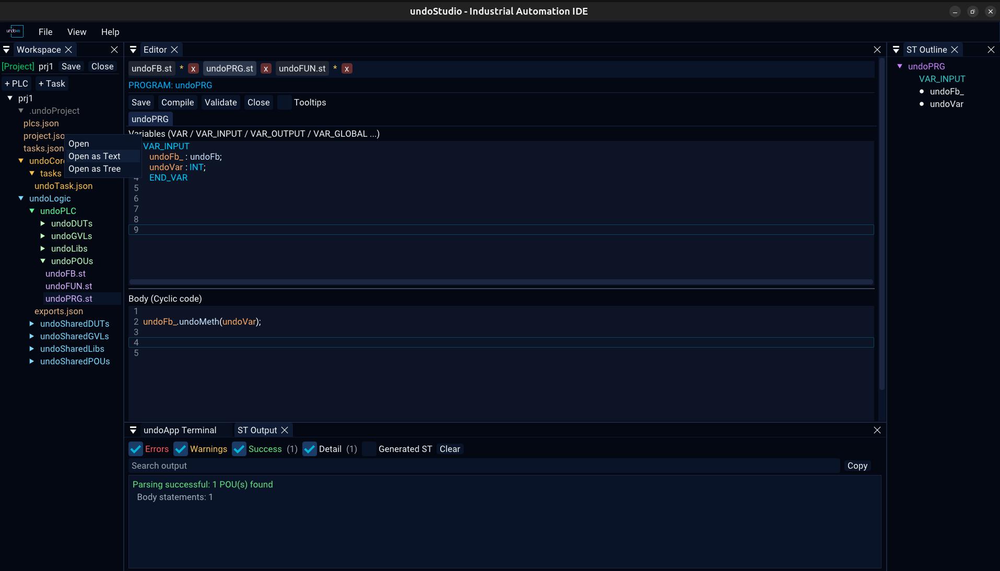

# Workspace

The Workspace panel is the file tree, and the toolbar that opens and creates
projects.

## With no project open

The panel offers **New Project** and **Open Project**, and the tree below them shows
the files of the folder that was picked as a workspace.

## With a project open

The header turns green and names the project, with **Save** and **Close** beside it.

## The tree

| | |
|---|---|
| Click | open the file, and keep its tab |
| Right-click | the context menu, below |
| Drag onto a folder | move the file there |

A file that is being previewed — opened once and left — is kept until another file
takes the slot, so browsing a folder does not empty the editor.

### The context menu, on a file

| Item | On | |
|---|---|---|
| **Open** | file | open it |
| **Open as Text** | `.json` | the editable view, [json.md](json.md) |
| **Open as Tree** | `.json` | the browsable view, [json.md](json.md) |
| **Add Method** | `.st` | ask for a name and add it, [structured-text.md](structured-text.md) |
| **Rename** | file | rename, following the tab with it |
| **Delete** | file | delete, with a confirmation |

### The context menu, on a folder

Inside a project the menu knows which folder it is on, because each one means
something different:

| Folder | Items |
|---|---|
| **POUs** | **New PROGRAM**, **New FUNCTION_BLOCK**, **New FUNCTION** |
| **GVLs** | **New GVL** |
| **DUTs** | **New STRUCT**, **New ENUM** |
| **Libs** | **Add Library File** |
| **undoLogic** | **Add PLC…** |
| **a PLC** | **Add Task…**, **Rename PLC…**, **Delete PLC** |
| **Tasks** | **Add Task…** |
| **anything else** | **New POU**, **New File**, **New Folder**, **Rename**, **Delete Folder** |

Node names in the tree are coloured by what they are: POUs and their kinds in
greens, `.st` files in violet, configuration and JSON in amber, configuration
folders in grey.

`Delete` is not on the keyboard: removing a file is not something a stray keypress
should do.

## Renaming moves everything

Four things file a document under its path — the tab, the key its text is held
under, the path a save goes to, and its entry in the recent files. A rename moves
all four, so `Ctrl+S` writes to the new name. A folder rename moves every file
inside it.

## Project configuration

A project, and everything the IDE reads from it, is described in JSON:
[projects.md](projects.md).